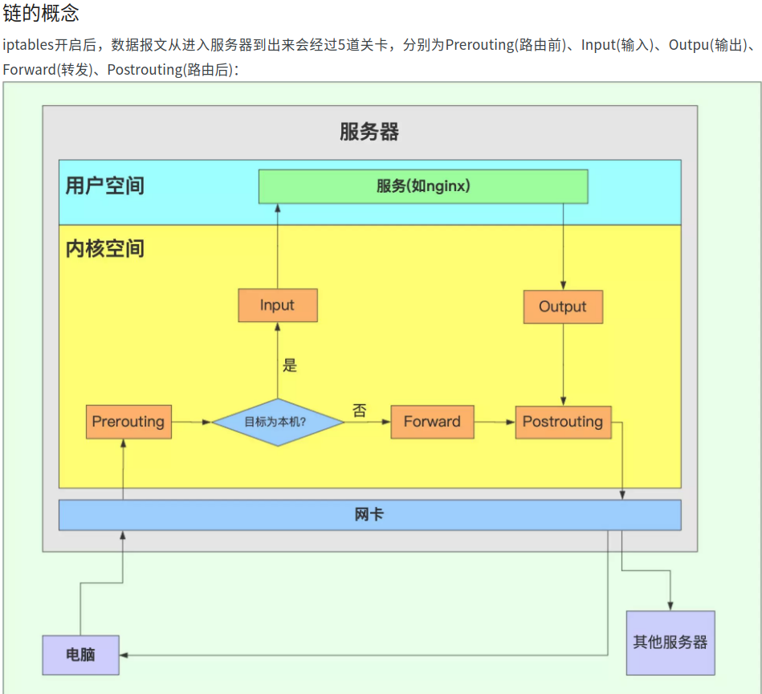

引用[https://www.jianshu.com/p/2312dd32361a](https://www.jianshu.com/p/2312dd32361a)
# **简单说明**

如果不经过本机，也就是做**路由**，则**需要内核允许转发**
```
# 方法一
sysctl net.ipv4.ip_forward=1
# 方法二
echo "1" > /proc/sys/net/ipv4/ip_forward
```
**规则表之间的优先顺序**
**Raw**——**mangle**——**nat**——**filter**
**INPUT**：当接收到防火墙本机地址数据包（入站）时，应用此链中的规则
**OUTPUT**：当防火墙本机向外发送数据包（出站）时，应用此链中的规则
**FORWARD**：当接收到需要通过防火墙发送给其他地址的数据包（转发）时，应用此链中的规则
**PREROUTING**：在对数据包做路由选择之前，应用此链中的规则，如DNAT
**POSTROUTING**：在对数据包做路由选择之后，应用此链中的规则，如SNAT
## **常用命令**
命令选项用于指定iptables的执行方式，包括插入规则，删除规则和添加规则，如下表所示
```
iptables -nvL
iptables -t nat -vnL是什么命令？
用详细方式列出 nat 表所有链的所有规则，只显示 IP 地址和端口号
iptables -L 
 粗略列出 filter 表所有链及所有规则
-P  --policy                <链名>  为指定链设置默认规则策略，对自定义链不起作 如：iptables -P OUTPUT DROP
# 在Chain中，所有的规则都是从上向下来执行的，也就是说，如果匹配了第一行，那么就按照第一行的规则执行，一行一行的往下找，直到找到 符合这个类型的包的规则为止。如果找了一遍没有找到符合这个包的规则怎么办呢？iptables里面有一个概念，就是Policy（策略），如果找了一遍找不到符合处理这个包的规则，就按照policy来办。iptables 使用-P来设置Chain的策略。
-L  --list                       <链名>  查看iptables规则列表
-A  --append             <链名>  在指定链尾部添加规则
-I  --insert                  <链名>  在指定的位置插入1条规则 iptables -I INPUT 1 --dport 80 -j ACCEPT
-D  --delete               <链名>  删除匹配的规则
-R  --replace             <链名>  替换匹配的规则
-F  --flush                   <链名>  删除表中所有规则
-Z  --zero                    <链名>  将表中数据包计数器和流量计数器归零
-X  --delete-chain   <链名>  删除自定义链
-v  --verbose             <链名>  与-L他命令一起使用显示更多更详细的信息
```
## **匹配规则**
匹配选项指定数据包与规则匹配所具有的特征，包括源地址，目的地址，传输协议和端口号，如下表所示
```
-i --in-interface        网络接口名>     指定数据包从哪个网络接口进入，
-o --out-interface   网络接口名>     指定数据包从哪个网络接口输出
-p ---proto                 协议类型        指定数据包匹配的协议，如TCP、UDP和ICMP等
-s --source                源地址或子网>   指定数据包匹配的源地址
--sport                        源端口号>       指定数据包匹配的源端口号
--dport                       目的端口号>     指定数据包匹配的目的端口号
-m --match               匹配的模块      指定数据包规则所使用的过滤模块
```
## **动作**
*   **REJECT**拦阻该数据包，并返回数据包通知对方，可以返回的数据包有几个选择：ICMP port-unreachable、ICMP echo-reply 或是tcp-reset（这个数据包包会要求对方关闭联机），进行完此处理动作后，将不再比对其它规则，直接中断过滤程序。 
*   **DROP**丢弃数据包不予处理，进行完此处理动作后，将不再比对其它规则，直接中断过滤程序。 
*   **REDIRECT**将封包重新导向到另一个端口（PNAT），进行完此处理动作后，将会继续比对其它规则。这个功能可以用来实作透明代理 或用来保护web 服务器。
*   **MASQUERADE**改写封包来源IP为防火墙的IP，可以指定port 对应的范围，进行完此处理动作后，直接跳往下一个规则链（mangle:postrouting）。这个功能与 SNAT 略有不同，当进行IP 伪装时，不需指定要伪装成哪个 IP，IP 会从网卡直接读取，当使用拨接连线时，IP 通常是由 ISP 公司的 DHCP服务器指派的，这个时候 MASQUERADE 特别有用。范例如下：
```
    iptables -t nat -A POSTROUTING -p TCP -j MASQUERADE --to-ports 21000-31000
```
*   **LOG**将数据包相关信息纪录在 /var/log 中，详细位置请查阅 /etc/syslog.conf 配置文件，进行完此处理动作后，将会继续比对其它规则。
*   **SNAT**改写封包来源 IP 为某特定 IP 或 IP 范围，可以指定 port 对应的范围，进行完此处理动作后，将直接跳往下一个规则炼（mangle:postrouting）。范例如下：
**所有从eth0出来的数据包的源地址改成61.99.28.1**
```
 iptables -t nat -A POSTROUTING -s 192.168.1.0/24 -o eth0 -j SNAT --to 61.99.28.1
```
*   **DNAT**改写数据包包目的地 IP 为某特定 IP 或 IP 范围，可以指定 port 对应的范围，进行完此处理动作后，将会直接跳往下一个规则链（filter:input 或 filter:forward）。范例如下：
**在路由之前所有从eth0进入的目的端口为53的数据包，都发送到1.2.3.4这台服务器解析**
```
 iptables -t nat -I PREROUTING -i eth0 -p tcp --dport 53 -j DNAT --to-destination 1.2.3.4:53
```
*   **MIRROR**镜像数据包，也就是将来源 IP与目的地IP对调后，将数据包返回，进行完此处理动作后，将会中断过滤程序。
    
*   **QUEUE**中断过滤程序，将封包放入队列，交给其它程序处理。透过自行开发的处理程序，可以进行其它应用，例如：计算联机费用.......等。
    
*   **RETURN**结束在目前规则链中的过滤程序，返回主规则链继续过滤，如果把自订规则炼看成是一个子程序，那么这个动作，就相当于提早结束子程序并返回到主程序中。
    
*   **MARK**将封包标上某个代号，以便提供作为后续过滤的条件判断依据，进行完此处理动作后，将会继续比对其它规则。

